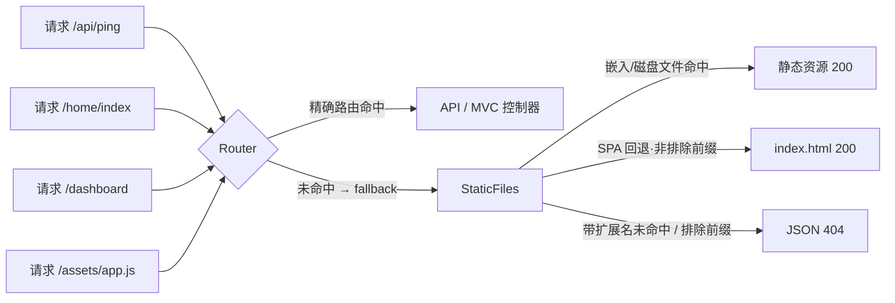

# SPA 与 MVC 一体化：单进程打包与运行

> 目标：像 C#/ASP.NET Core 那样——**前端构建产物随后端一起打包**（编译期嵌入单 exe），
> 运行时**一个进程、一个端口**同时提供 API、MVC 页面（Razor 服务端渲染）与 SPA，
> 而不是"前端一个项目、后端一个项目"分开部署。
>
> 相关代码：`src/net/static_files.rs`（嵌入 + SPA 回退）、`src/net/controller.rs`（MVC 控制器与视图）、
> 示例 `examples/spa_server.rs`（可运行参考）。

---

## 1. 与 C#（ASP.NET Core）的对照

| ASP.NET Core | dhrust 对应 | 说明 |
|---|---|---|
| `app.UseStaticFiles()`（`wwwroot/` 目录） | `StaticFiles::new("wwwroot")` | 按请求读盘，开发期改文件即生效 |
| 单文件发布 / `ManifestEmbeddedFileProvider` | `StaticFiles::embed` / `embed_many`（`include_bytes!`） | 编译期嵌入、嵌入优先，部署不依赖 wwwroot |
| `endpoints.MapControllers()` | `Controller::new("api")...mount(&mut router)` | JSON 控制器（统一信封 `json_result`） |
| MVC 视图（`Views/{C}/{A}.cshtml`） | `Controller` + `view(model)`（feature `razor`） | 服务端渲染，与 C# 视图约定一致 |
| `endpoints.MapFallbackToFile("index.html")` | `StaticFiles::spa_fallback(true)` | 未命中请求回退 `index.html`（history 路由） |
| `MapFallbackToFile` 搭配路由排除 `/api` | `StaticFiles::spa_excludes(&["/api"])` | 后端命名空间保持 JSON 404 |
| 开发期 `SpaProxy`（Vite dev server 代理） | 前端 dev server 配 `proxy: { '/api': 'http://127.0.0.1:5501' }` | 开发两进程、生产一体（见 §5） |

## 2. 请求管线（一个端口内的优先级）



规则（`try_serve_request`）：

1. **文件优先**：嵌入资源 → 磁盘目录（`wwwroot/`），路径穿越等危险路径直接拒绝（且不触发回退）；
2. **SPA 回退条件**（启用 `spa_fallback` 且未落在 `spa_excludes` 前缀内，任一即可）：
   - 路径最后一段不含 `.`（`/dashboard`、`/user/42`、目录结尾）；
   - 浏览器导航：`Accept` 含 `text/html`（history 深链硬刷新）；
3. **不满足回退**（如 `/assets/missing.js`、`/logo.png`）→ 返回 `None`，由调用方回 404。

## 3. 最小可用代码

```rust
use dhrust::net::http::{HttpOutcome, HttpResponse, HttpServer};
use dhrust::net::router::{route, Router};
use dhrust::net::static_files::StaticFiles;

// 资源表：真实项目由 build.rs 生成后 include!（见 §4）；此处示意
include!(concat!(env!("OUT_DIR"), "/spa_files.rs")); // pub static SPA_FILES: &[(&str, &[u8])]

let mut router = Router::new();
// …注册 API / MVC 控制器（略）…

let statics = StaticFiles::new("wwwroot") // 开发期目录（可不存在；嵌入优先）
    .embed_many(SPA_FILES)               // 编译期嵌入整个 dist
    .spa_fallback(true)                  // history 路由回退 index.html
    .spa_excludes(&["/api", "/star"]);   // 后端命名空间不参与回退

router.fallback(route(move |ctx| {
    let statics = statics.clone();
    async move {
        // GET/HEAD：文件 → SPA 回退；其他方法只允许命中真实文件
        let method_ok = ctx.req.method.eq_ignore_ascii_case("GET")
            || ctx.req.method.eq_ignore_ascii_case("HEAD");
        let served = if method_ok {
            statics.try_serve_request(&ctx.req)
        } else {
            statics.try_serve_file(&ctx.req.path)
        };
        if let Some(response) = served {
            return HttpOutcome::Response(response);
        }
        HttpOutcome::Response(HttpResponse::text(404, "Not Found"))
    }
}));

let server = HttpServer::bind("0.0.0.0:8080").await?;
server.serve(router.into_handler()).await
```

不嵌入手写也行——只把前端 `dist` 目录内容拷到 `wwwroot/` 即"目录模式"，
`StaticFiles::default()` 即可服务（适合开发期热更新，不重新编译 Rust）。

## 4. 批量嵌入：build.rs 生成器（零新依赖）

Vue/Vite 产物是几十个带哈希名的文件，逐行 `embed()` 不现实。
在消费方项目根放一个 `build.rs`（零新增依赖），扫描 `dist` 生成资源表：

```rust
//! build.rs —— SPA 资源表生成器（放到消费方项目根；目录按需修改）
use std::env;
use std::fs;
use std::path::{Path, PathBuf};

const DIST_DIR: &str = "web/dist"; // ← 前端构建输出目录

fn main() {
    let manifest = PathBuf::from(env::var("CARGO_MANIFEST_DIR").unwrap());
    let dist = manifest.join(DIST_DIR);

    println!("cargo:rerun-if-changed={}", dist.display());
    println!("cargo:rerun-if-changed=build.rs");

    let mut files = Vec::new();
    collect(&dist, &dist, &mut files);
    files.sort();

    let mut code = String::from(
        "/// 由 build.rs 生成的 SPA 嵌入资源表（相对路径 → 文件字节）。\n\
         pub static SPA_FILES: &[(&str, &[u8])] = &[\n",
    );
    for (rel, abs) in &files {
        // 单文件级 rerun-if-changed：任一产物增删改都会触发重新生成
        println!("cargo:rerun-if-changed={}", abs.display());
        // {:?} 输出合法的 Rust 字符串字面量（转义由 Debug 保证）
        code.push_str(&format!("    ({rel:?}, include_bytes!({abs:?})),\n"));
    }
    code.push_str("];\n");

    if files.is_empty() {
        println!(
            "cargo:warning=SPA 资源目录不存在或为空：{}（已生成空资源表，请先执行前端构建）",
            dist.display()
        );
    }

    let out = PathBuf::from(env::var("OUT_DIR").unwrap()).join("spa_files.rs");
    fs::write(out, code).unwrap();
}

/// 递归收集 dist 下的全部文件（相对路径 → 绝对路径）。
fn collect(root: &Path, dir: &Path, out: &mut Vec<(String, PathBuf)>) {
    let Ok(entries) = fs::read_dir(dir) else { return };
    for entry in entries.flatten() {
        let path = entry.path();
        if path.is_dir() {
            collect(root, &path, out);
        } else if let Ok(rel) = path.strip_prefix(root) {
            out.push((rel.to_string_lossy().to_string(), path));
        }
    }
}
```

应用侧：

```rust
include!(concat!(env!("OUT_DIR"), "/spa_files.rs"));
let statics = StaticFiles::new("wwwroot").embed_many(SPA_FILES).spa_fallback(true);
```

要点：

- `rerun-if-changed` 为**每个文件**发出，文件增删改都会触发 build.rs 重跑（重新生成表再重编）；
- 前端未构建时生成**空表**并给出 `cargo:warning`——不影响后端单独编译；
- 生成表里使用绝对路径的 `include_bytes!`，与生成文件位置无关；
- MIME 由 `embed_many` 按扩展名自动推断（html/css/js/json/svg/png/woff2…）。

## 5. 开发与生产工作流

**开发（两进程，热更新最快）**

- 前端：`npm run dev`（Vite，例如 5173），`vite.config.ts` 里配置 API 代理：

```ts
server: {
  proxy: { '/api': { target: 'http://127.0.0.1:8080', changeOrigin: true } }
}
```

- 后端：`cargo run`——静态文件处于**目录模式**（`wwwroot/` 为空也不影响），
  或临时把 `dist` 输出到 `wwwroot/` 直接联调（无需重编 Rust）。

**生产（单 exe，无前端运行环境）**

```bash
npm run build            # 产出 web/dist（哈希文件名、互相引用）
cargo build --release    # build.rs 嵌入 → 单个可执行文件
```

- 单进程/单端口：API、MVC 页面、SPA、WebSocket 共用；
- 无 CORS、无 nginx 必需、无 Node 运行环境；
- 多平台交叉编译不受影响（嵌入内容是平台无关的字节，Pek.RAgent 面板已有五平台先例）。

## 6. SPA 与 MVC 同时存在

三者按注册顺序叠加，互不冲突：

| 路径 | 归属 | 机制 |
|---|---|---|
| `/api/*`、`/star/*` | API 控制器 | `Controller::new("api")…mount()`（先注册，优先匹配） |
| `/home/index` | MVC 页面 | Razor 视图 `view(model)`（feature `razor`） |
| `/assets/*`、`/favicon.ico` | SPA 静态资源 | fallback 中的 `StaticFiles` |
| `/dashboard`、`/user/42` | SPA 前端路由 | `spa_fallback(true)` 回退 `index.html` |
| `/api/unknown` | JSON 404 | 排除前缀（不回退 HTML） |

可运行参考 `examples/spa_server.rs`：

```bash
cargo run --features "net,razor" --example spa_server -- 8080
# GET /              → SPA 首页          GET /dashboard          → 回退 index.html
# GET /assets/*.js   → 嵌入资源           GET /home/index         → Razor 服务端渲染
# GET /api/ping      → JSON              GET /api/unknown        → JSON 404（排除前缀）
# 带 Accept: text/html 的 /legacy/page.html → 回退 index.html
```

选型建议：

- 需要 SEO/首屏直出/后台管理复杂表单 → Razor 服务端渲染页面（MVC）；
- 交互密集/移动端/增量上线 → SPA，且 SPA 也可以调用同一套 `/api`；
- 同一站点混用（部分页面 SSR、部分 SPA）正是上表的默认能力，不需要两套部署。

## 7. 行为细则

- **回退判定**：`spa_route_like(path, accept)`——`Accept` 含 `text/html`，或路径最后一段不含 `.`；
- **排除前缀**：段边界匹配、大小写不敏感；`/apiary` 不属于 `/api`（不会误排除）；
- **安全检查先于回退**：`../`、`\`、`:`、`%` 等危险路径一律拒绝，且**不会**被回退成 index.html；
- **方法限制**：非 GET/HEAD 用 `try_serve_file`（只服务真实文件），未知路径由业务回 JSON 404；
- **默认文档**：`/` 与目录结尾命中 `index.html`（与 SPA 回退共用同一文档）；
- **缓存头（内置）**：静态响应自带 `ETag` + `Cache-Control: no-cache`（`If-None-Match` 未变 → `304`，重复打开零正文）；哈希文件名资源可再追加强缓存：

```rust
let mut resp = statics.try_serve_request(&ctx.req)?;
if ctx.req.path.starts_with("/assets/") {
    resp = resp.with_header("Cache-Control", "public, max-age=31536000, immutable");
}
```

## 8. 常见问题

| 问题 | 说明 |
|---|---|
| 前端构建后 Rust 全量重编？ | build.rs 重跑 + `include_bytes!` 依赖变化必然触发重编；release（LTO）链接较慢属预期，开发期用目录模式规避 |
| 二进制变大？ | dist 原样进二进制（压缩后进 tar/zip 会小很多）；HTTP 响应已内建 gzip 协商（`net` 特性，面板 HTML/JSON 出网流量约 -70%/-45%） |
| hash 路由（`#/x`）还需要回退吗？ | 不需要，但开启无副作用；建议直接开，将来换 history 路由零改动 |
| 多个后端命名空间？ | `spa_excludes(&["/api", "/star", "/internal"])` 一次列全 |
| 嵌入资源与 wwwroot 同时存在？ | 嵌入优先（部署稳定），磁盘作开发期覆盖/兜底 |
